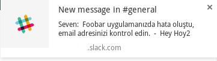
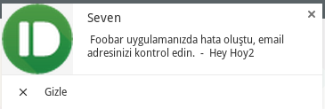
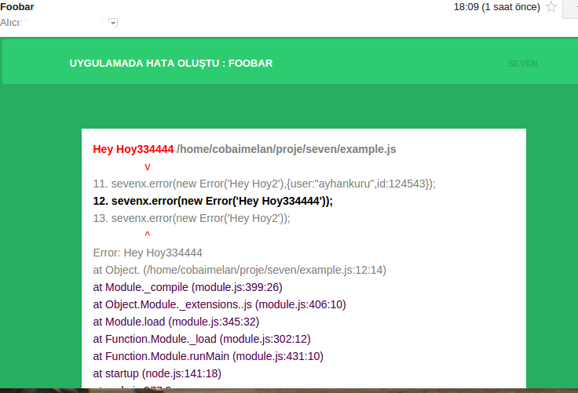

<div align="center">
  <a href="https://www.youtube.com/watch?v=Ki9h7CWipbo"></a>
</div>
<br>


## Install

```sh
npm install seven
#or
npm install --save seven
```

## Usage

```sh
import Seven from 'seven';

const seven = new Seven();


fs.readFile('./blaxx',(err,content)=>{
  if(err){
    seven.error(err);
  }
})

// or

function(msg){
  if(msg){
    seven.error(new Error('msg not found!'));
  }

}
 // or type error  env SEVEN='active' need..

 true;
 314156 + err++;
 false;


```
## Configure
sample configuration file
```js
// seven.conf.js
module.exports = {
     appname:'WhiteRabbit',
     template:{
       params:{
         title:`Uygulamada hata oluştu : {appname} `,
         year:new Date().getFullYear(),
         author:'ayhankuru'
       }
     },
     email:{
       transport:{
         service: 'Gmail',
         auth: {
             user: process.env.gmailu,
             pass: process.env.gmailp
         }
       },
       list:['cobaimelan@protonmail.ch','cobaimelan@yandex.com.tr'],
       sender:' {appname}  <johndoe@gmail.com>'
     },
     pushbullet:{
       apikey:process.env.pbulletapikey,
       devices:['browser']
     },
     slack:{
       apikey:process.env.slackapikey,
       channels:['general']
     }
}

```

## Config Params List
| params | require | desc |
| ------- | -------|------|
| appname |  ✔️ | application name|
| watch |  - | watch uncaught nodejs errors|
| timeout |  - | timeout send eror message|
| template.path |  - | custom email template path|
| template.params |  - | extra email params|

### email
| params | require | desc |
| ------- | -------|------|
| transport |  ✔️ | [example transport usage](https://github.com/andris9/nodemailer-smtp-transport#usage)|
| list |  ✔️ | array email sender list|
| sender |  - | sender title |
| cron |  - | a certain time must be specified example; `24 hour` |

### pushbullet
| params | require | desc |
| ------- | -------|------|
| apikey |  ✔️ | pushbullet apikey|
| devices |  ✔️ | array device name|
| message |  - | custom message body example; `I found eror haha {appname}, checkout email `|
| cron |  - | a certain time must be specified example; `24 hour` |

### slack
before create slack [bot](https://my.slack.com/services/new/bot)

| params | require | desc |
| ------- | -------|------|
| apikey |  ✔️ | slack bot apikey|
| channels |  - | array channels name|
| users |  - | array users name|
| groups |  - | array groups name|
| message |  - | custom message body example; `I found eror haha {appname}, checkout email `|
| cron |  - | a certain time must be specified example; `24 hour` |


## Debug
```sh
env DEBUG='seven,seven:pushbullet,seven:email,seven:slack' node example.js
```
watch uncaught nodejs errors

```sh
env SEVEN='active' node example.js
```




